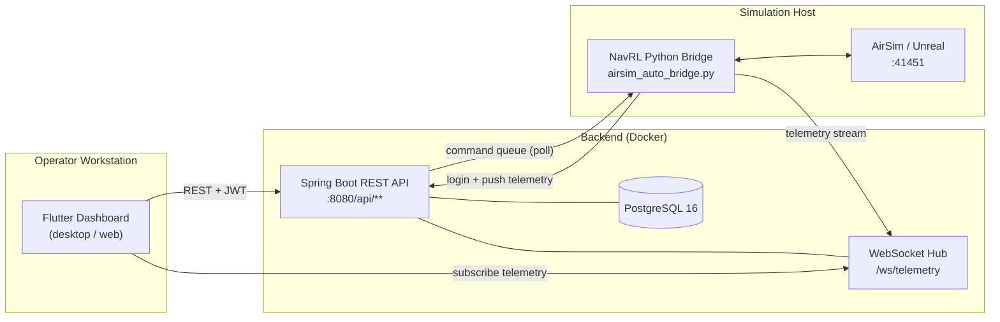

# Drone Command Center

A full-stack capstone system for **autonomous drone command and control**: a Spring Boot REST/WebSocket backend, a Flutter desktop / web / Android dashboard, and a Python NavRL + AirSim flight bridge that flies a virtual quadrotor through cluttered urban scenes in response to operator commands.

> **Stack at a glance**
> Backend: Spring Boot 4.0.2 · Java 17 · PostgreSQL 16 · JWT auth · WebSocket telemetry
> Frontend: Flutter 3 (Windows desktop, Web, Android APK) · Dio · Riverpod
> Autonomy: Python 3.10 · AirSim · NavRL (PPO) · LiDAR-based occupancy mapping

---

## Architecture



* The **operator** issues missions through the Flutter UI.
* The **backend** persists missions, queues commands, and broadcasts live telemetry over WebSocket.
* The **bridge** authenticates as a service account, polls for commands, and drives the AirSim drone using NavRL's learned obstacle-avoidance policy.

---

## Quick start

### Prerequisites

| Tool | Version | Used for |
|------|---------|----------|
| Docker Desktop | 4.x | Backend + Postgres |
| Flutter SDK | 3.x | Frontend |
| Python | 3.10+ | NavRL bridge |
| AirSim + Unreal | — | Drone simulator (only for autonomous-flight demo) |

### 1. Clone & configure

```powershell
git clone https://github.com/MohamadA20-hash/Deep-RL-Drone-Obstacle-Avoidance-Navigation-with-D.C.C-Drone-Command-Center-.git drone-command-center
cd drone-command-center
Copy-Item .env.example .env
# Open .env and fill in DB_PASSWORD, JWT_SECRET, BRIDGE_AUTH_PASS
```

### 2. Start the backend stack

```powershell
.\run-demo.ps1
```

The script loads `.env`, runs `docker compose up --build`, waits for `/actuator/health` to report `UP`, then prints the next steps. Backend will be at <http://localhost:8080>, Swagger at <http://localhost:8080/swagger-ui.html>.

> **First start seeds the database** with a demo operator (`operator` / `Operator@2026!`), the bridge service user (`navrl_bridge`), one sample drone (`Alpha Scout`), and two sample missions (`Building Inspection Demo`, `Perimeter Patrol Demo`). Disable in production with `APP_SEED_ENABLED=false`.

### 3. Run the frontend (in a new terminal)

```powershell
cd frontend
flutter pub get
flutter run -d windows `
    --dart-define=API_BASE_URL=http://localhost:8080 `
    --dart-define=WS_BASE_URL=ws://localhost:8080
```

#### Android APK (optional — phone on the same Wi-Fi as the laptop)

Replace `192.168.0.105` with your laptop's LAN IP (`ipconfig` → IPv4 of your active adapter).

```powershell
cd frontend
flutter build apk --release `
    --dart-define=API_BASE_URL=http://192.168.0.105:8080 `
    --dart-define=WS_BASE_URL=ws://192.168.0.105:8080 `
    --dart-define=FPV_BASE_URL=http://192.168.0.105:8766/fpv
```

The APK lands at `frontend/build/app/outputs/flutter-apk/app-release.apk`. Copy it to the phone's Download folder and tap to install (allow "install unknown apps" the first time). On the laptop, open Windows Firewall for the backend + FPV bridge ports:

```powershell
New-NetFirewallRule -DisplayName "DCC Backend 8080" -Direction Inbound -Protocol TCP -LocalPort 8080 -Action Allow
New-NetFirewallRule -DisplayName "DCC FPV 8766"     -Direction Inbound -Protocol TCP -LocalPort 8766 -Action Allow
```

Laptop demo and phone demo can run **simultaneously** against the same backend.

### 4. Run the AirSim bridge (in a new terminal)

Launch your AirSim/Unreal scene first, then:

```powershell
cd capstone\airsim_testing
# Pick up env vars from the project .env
$env:BRIDGE_AUTH_PASS = (Select-String -Path ..\..\.env -Pattern '^BRIDGE_AUTH_PASS=' | ForEach-Object { ($_ -split '=',2)[1] })
python airsim_auto_bridge.py
```

### 5. Stop everything

```powershell
docker compose down          # keep DB data
docker compose down -v       # also wipe DB volume
```

---

## Demo script (15 min)

| # | Step | Where | Notes |
|---|------|-------|-------|
| 1 | Log in as `operator` / `Operator@2026!` | UI | Pre-seeded by `DataSeeder` on first run |
| 4 | Launch AirSim scene | Unreal | Wait for sim to load fully |
| 5 | `python airsim_auto_bridge.py` | terminal 3 | Authenticates as `navrl_bridge` (also pre-seeded) |
| 6 | Open the **Perimeter Patrol Demo** mission | UI → Missions | Pre-seeded sample mission |
| 7 | Start mission | UI | Drone arms, scans 360°, plans, flies |
| 8 | Watch live telemetry + FPV stream | UI | Verify trajectory, obstacle avoidance |
| 9 | Hit **EMERGENCY LAND** then log out | UI | Clean shutdown |

> **Kill switch:** the red `EMERGENCY` button on the live map calls `POST /api/navrl/drones/{id}/emergency-land`, which immediately interrupts navigation and lands the drone. Always rehearse pressing it before the live demo.

---

## Testing

```powershell
# Backend unit tests (62 tests, ~30 s)
cd backend; .\mvnw test

# Flutter static analysis
cd frontend; flutter analyze
```

CI runs both on every push to `main` and every pull request — see [.github/workflows/ci.yml](.github/workflows/ci.yml).

---

## Reports & figures

The final written report and supporting artifacts live under `report/`:

* `report/DCC report.docx` — final capstone report
* `report/figures/` — figures referenced in the report
* `report/uml/` — UML diagrams
* `report/zap/` — OWASP ZAP baseline scan output

---

## Repository layout

```
drone-command-center/
├── backend/                       Spring Boot 4 / Java 17 REST API
│   ├── src/main/java/             Controllers, services, security, JPA
│   ├── src/main/resources/        application.properties, Flyway migrations
│   ├── Dockerfile                 Multi-stage build → eclipse-temurin:17-jre
│   └── pom.xml
├── frontend/                      Flutter dashboard (Windows desktop, web, Android)
│   ├── lib/                       core/, features/, ui/
│   ├── android/                   Android target (APK build)
│   ├── windows/                   Windows desktop runner
│   ├── web/                       Flutter web entrypoint
│   └── pubspec.yaml
├── capstone/airsim_testing/       Python NavRL + AirSim bridge
│   ├── airsim_auto_bridge.py      Bridge entrypoint
│   ├── navrl_city_planner.py      NavRL planner + occupancy mapping
│   ├── command_center_bridge.py   Backend REST/WS client
│   ├── navrl_model/               PPO policy weights and network code
│   └── results/                   Evaluation runs used in the report
├── report/                        Capstone report (docx) + figures, UML, ZAP
├── docker-compose.yml             Postgres + backend
├── .env.example                   Environment template — copy to .env
└── run-demo.ps1                   One-shot launcher (Windows)
```

---

## Useful commands

```powershell
# Backend logs
docker compose logs -f backend

# Open psql in the running Postgres container
docker compose exec postgres psql -U postgres -d drone_command_center

# Rebuild backend after code changes
docker compose up -d --build backend

# Run backend unit tests (host)
cd backend; .\mvnw test

# Run a Flutter widget test
cd frontend; flutter test
```

---

## Security notes

* `.env` is git-ignored — do not commit real secrets.
* `JWT_SECRET` must be a fresh base64 key on every deployment; the placeholder in `application.properties` is for local dev only.
* `BRIDGE_AUTH_PASS` is a shared secret between backend and bridge — rotate on suspicion.
* Flyway is intentionally disabled (see `application.properties` for context). Schema is owned by Hibernate `ddl-auto=update` for the demo. Re-enable Flyway before production.

---

## License

Capstone project — academic use.
